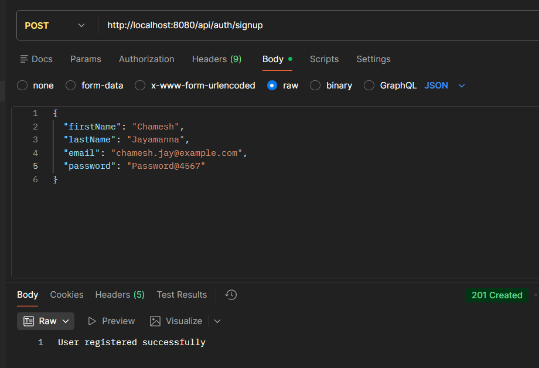
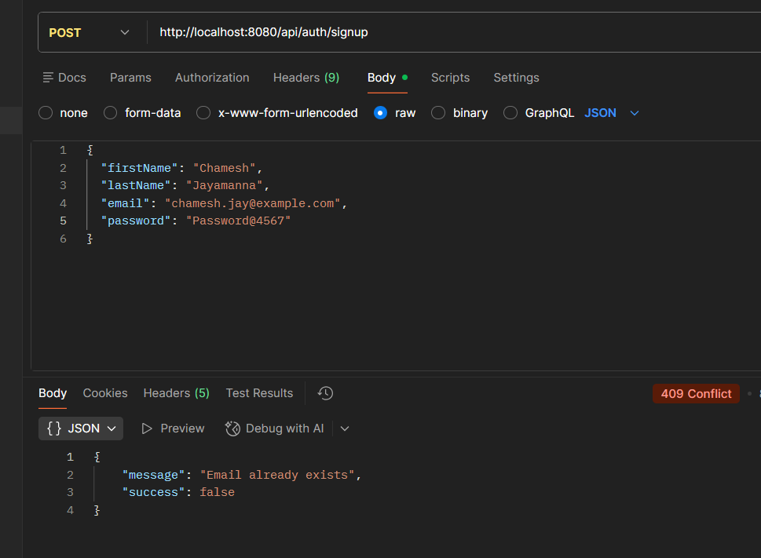
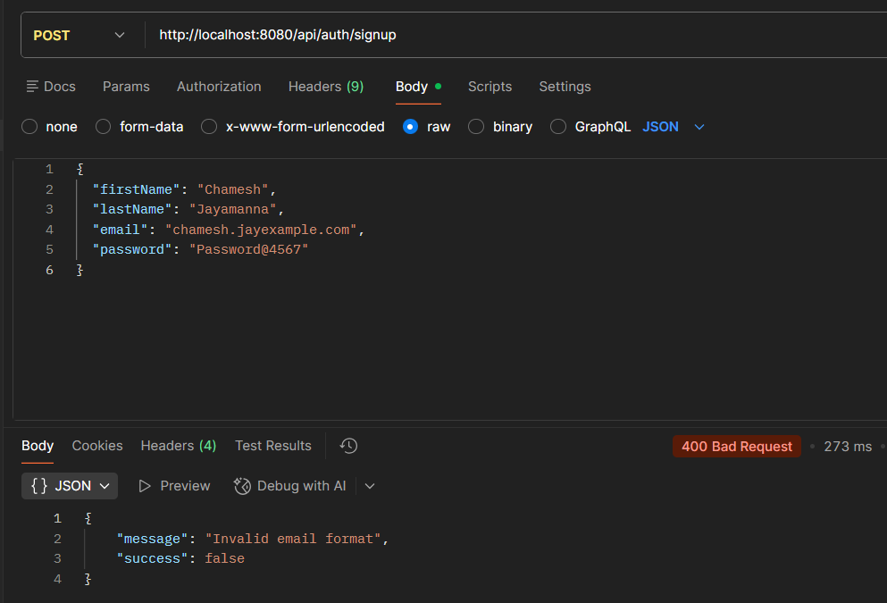
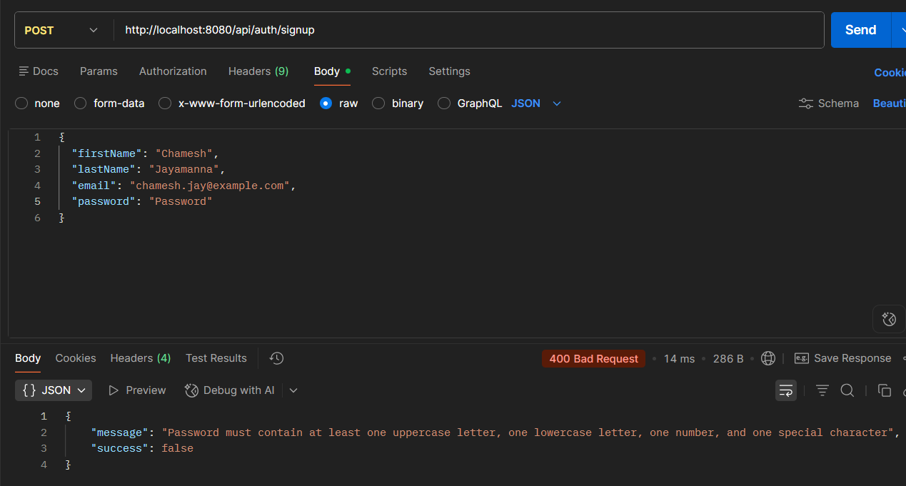
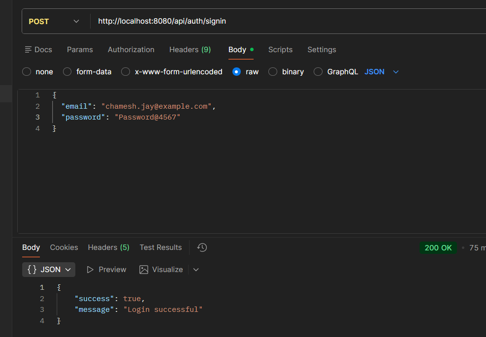
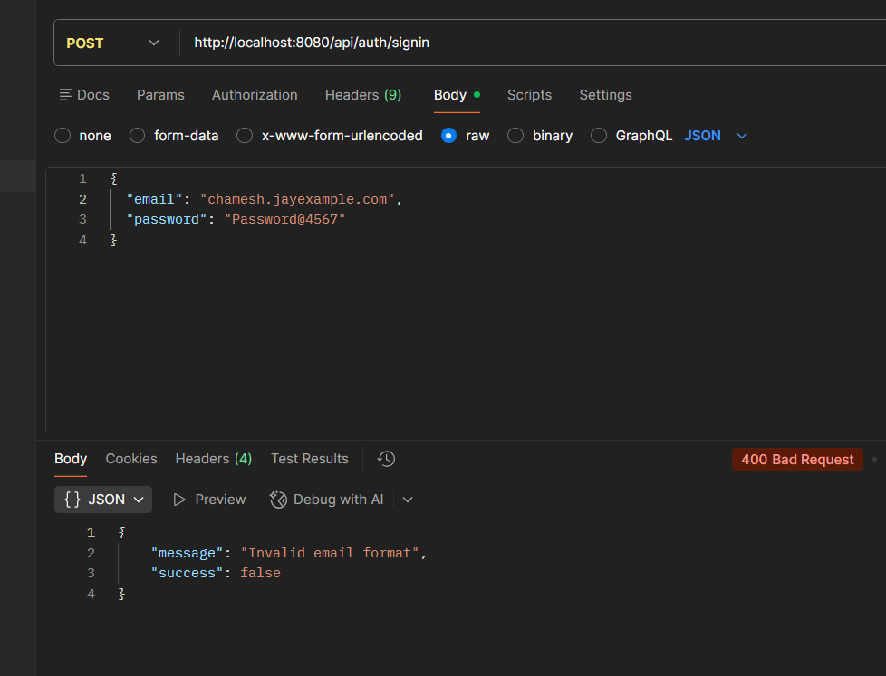
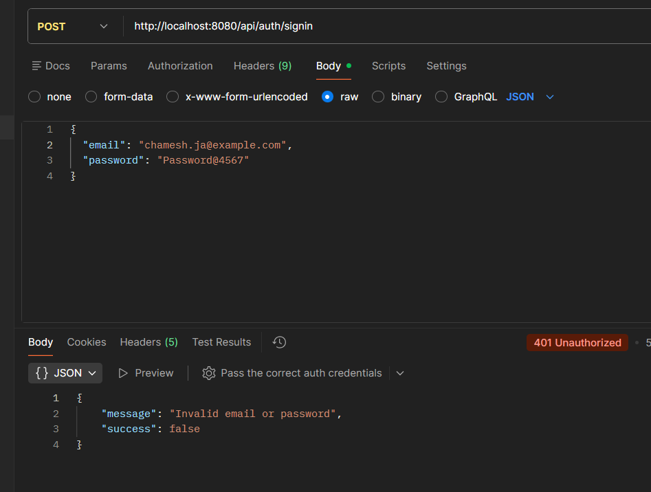
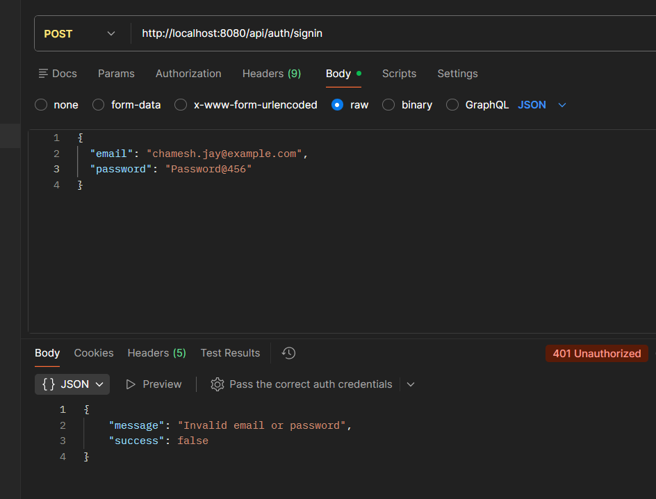

# Sawiya Authentication API

## Overview

A RESTful User Authentication API built with Java and Spring Boot. The application provides secure user registration and sign-in functionality using a relational MySQL database, JPA/Hibernate, input validation, and BCrypt password hashing.

The project was developed as a backend technical assignment for Sawiya, with a focus on clean architecture, security, maintainability, and production-minded backend practices.

## Features

* User registration with input validation
* User sign-in with credential verification
* Email format validation
* Email normalization for consistent authentication
* Duplicate email detection
* Secure password hashing using BCrypt
* Generic authentication failure responses
* Global exception handling
* Appropriate HTTP status codes
* MySQL database integration using JPA/Hibernate
* Unit tests using JUnit and Mockito

## Technologies

* Java 17
* Spring Boot 4.1.1
* Spring WebMVC
* Spring Data JPA / Hibernate
* Spring Validation
* Spring Security Crypto (BCrypt)
* MySQL
* JUnit 5
* Mockito
* Maven
* Lombok

## Project Structure

```text
src/
├── main/
│   ├── java/com/sawiya/auth/
│   │   ├── config/
│   │   │   └── PasswordConfig.java
│   │   ├── controller/
│   │   │   └── AuthController.java
│   │   ├── dto/
│   │   │   ├── SigninRequestDTO.java
│   │   │   ├── SigninResponseDTO.java
│   │   │   └── SignupRequestDTO.java
│   │   ├── entity/
│   │   │   └── User.java
│   │   ├── exception/
│   │   │   ├── DuplicateEmailException.java
│   │   │   ├── GlobalExceptionHandler.java
│   │   │   └── InvalidCredentialsException.java
│   │   ├── repository/
│   │   │   └── UserRepository.java
│   │   └── service/
│   │       └── AuthService.java
│   └── resources/
│       └── application.properties
└── test/
    └── java/com/sawiya/auth/service/
        └── AuthServiceTest.java
```

The application follows a layered architecture:

```text
Controller → Service → Repository → Database
```

This separation keeps responsibilities clear and makes the application easier to maintain and extend.

## API Endpoints

### 1. User Signup

**POST** `/api/auth/signup`

Registers a new user after validating the supplied information.

#### Request

```json
{
  "firstName": "Chamesh",
  "lastName": "Jayamanna",
  "email": "chamesh.jay@example.com",
  "password": "Password@4567"
}
```

#### Successful Response

**HTTP 201 Created**

```text
User registered successfully
```

#### Duplicate Email

**HTTP 409 Conflict**

```json
{
  "success": false,
  "message": "Email already exists"
}
```

#### Validation Error

**HTTP 400 Bad Request**

Returned when the request contains invalid or missing fields.

Example:

```json
{
  "firstName": "John",
  "lastName": "Doe",
  "email": "invalid-email",
  "password": "abc123"
}
```

Example response:

```json
{
  "success": false,
  "message": "Invalid email format"
}
```

Password validation requires:

* At least 8 characters
* At least one uppercase letter
* At least one lowercase letter
* At least one number
* At least one special character

Validation errors are handled centrally using the global exception handler.

### 2. User Sign-in

**POST** `/api/auth/signin`

Authenticates a registered user using their email and password.

#### Request

```json
{
  "email": "chamesh.jay@example.com",
  "password": "Password@4567"
}
```

#### Successful Response

**HTTP 200 OK**

```json
{
  "success": true,
  "message": "Login successful"
}
```

#### Invalid Credentials

**HTTP 401 Unauthorized**

```json
{
  "success": false,
  "message": "Invalid email or password"
}
```

The same authentication error is returned for both an unknown email and an incorrect password to avoid revealing whether a particular email address is registered.

## Validation Rules

### Email

* Email is required.
* Email must follow a valid email format.
* Email is normalized to lowercase before storage and authentication.
* Email addresses must be unique.

### Password

For signup, passwords must:

* Be at least 8 characters long.
* Contain at least one uppercase letter.
* Contain at least one lowercase letter.
* Contain at least one number.
* Contain at least one special character.

For signin, the password is required.

## Security

* Passwords are never stored in plain text.
* Passwords are hashed using **BCrypt** before being stored in the database.
* Supplied passwords are verified using BCrypt's password matching mechanism.
* Authentication failures return a generic `Invalid email or password` message to avoid revealing whether an email address exists.
* Database credentials are provided through environment variables rather than being hardcoded in the application configuration.
* Input validation is applied using Jakarta Bean Validation.

## HTTP Status Codes

| Status Code        | Usage                              |
| ------------------ | ----------------------------------- |
| `200 OK`           | Successful signin                  |
| `201 Created`      | Successful signup                  |
| `400 Bad Request`  | Invalid or missing request data    |
| `401 Unauthorized` | Invalid authentication credentials |
| `409 Conflict`     | Duplicate email during signup      |

## Database Configuration

The application uses **MySQL** with **Spring Data JPA / Hibernate**.

Create a database named:

```text
sawiya_auth
```

Database credentials are configured using environment variables:

```text
DB_USERNAME
DB_PASSWORD
```

The application configuration uses:

```properties
spring.datasource.username=${DB_USERNAME}
spring.datasource.password=${DB_PASSWORD}
```

The database schema is automatically managed by Hibernate during development using:

```properties
spring.jpa.hibernate.ddl-auto=update
```

## Running the Application

### Prerequisites

* Java 17
* Maven
* MySQL

### Steps

1. Clone the repository.

2. Create the MySQL database:

```sql
CREATE DATABASE sawiya_auth;
```

3. Configure the following environment variables:

```text
DB_USERNAME=root
DB_PASSWORD=your_mysql_password
```

4. Start the Spring Boot application.

The API will be available at:

```text
http://localhost:8080
```

## Testing

Unit tests are implemented using **JUnit 5 and Mockito**.

The current test coverage includes:

* Successful signin with valid credentials
* Signin with an incorrect password
* Signin with a non-existing email
* Signup with a duplicate email

Run the tests using Maven:

```bash
mvn test
```

The tests do not require the application or MySQL database to be running because repository and password encoder dependencies are mocked.

### API Testing

The REST APIs were also manually tested using **Postman**.

The following scenarios were verified:

* Successful user registration
* Successful sign-in
* Duplicate email registration
* Invalid email format – signup and signin
* Invalid password validation – signup
* Missing required fields
* Sign-in with incorrect password
* Sign-in with a non-existing email
* Case-insensitive email handling

#### Screenshots

**Successful Signup**



**Duplicate Email**



**Invalid Email Signup**



**Invalid Password Signup**



**Successful Signin**



**Invalid Email Signin**



**Incorrect Email Signin**



**Incorrect Password Signin**


